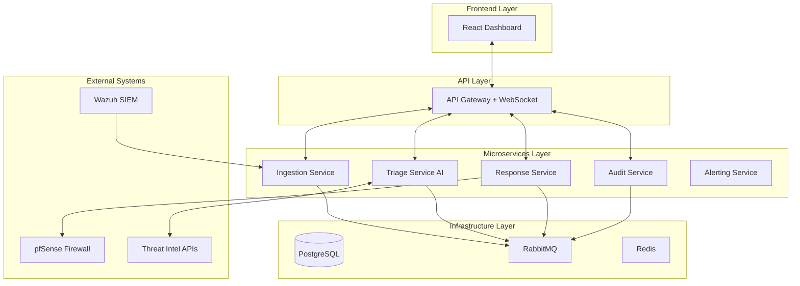

# Ransomware Response System - Complete Project Analysis
**Document Created:** December 6, 2025  
**Project Repository:** TheBinaryBhatt/ransomware-response-system  
**Author:** TheBinaryBhatt  
**Status:** Phase 11 (Frontend Development) - ~90% Complete  
________________________________________

## Executive Summary
The Ransomware Response System (RRS) is an enterprise-grade, AI-powered cybersecurity orchestration platform designed to automate the complete lifecycle of ransomware threat detection, analysis, and response. Built with a modern microservices architecture, this system represents a production-ready Security Operations Center (SOC) automation solution that can detect, triage, and respond to security incidents with minimal human intervention.

### Core Mission
To provide SOC teams with an intelligent, automated threat response platform that reduces incident response time from hours to seconds through AI-powered triage, automated containment actions, and comprehensive audit trails.

________________________________________

## 🏗️ Project Architecture Overview

### High-Level Architecture


### Design Principles
1. **Microservices Architecture** - Each service has a single responsibility and can scale independently
2. **Event-Driven Communication** - RabbitMQ topic exchange for asynchronous, decoupled messaging
3. **Real-time Updates** - WebSocket integration for live dashboard updates
4. **Immutable Audit Trail** - SHA-256 hashed audit logs for compliance and forensics
5. **Cloud-Ready Design** - Containerized with Docker, ready for Kubernetes orchestration

________________________________________

## 📁 Root Directory Structure Analysis

### Complete File Tree
```
ransomware-response-system/
├── backend/                    # Python backend microservices (151 files)
│   ├── core/                   # Shared utilities (10 files)
│   ├── gateway/                # API Gateway (899 lines, 53+ endpoints)
│   ├── ingestion_service/      # Alert preprocessing (12 files)
│   ├── triage_service/         # AI-powered analysis (29 files)
│   ├── response_service/       # Automated response (26 files)
│   ├── audit_service/          # Logging & compliance (14 files)
│   ├── alerting_service/       # Notifications (6 files)
│   └── shared_lib/             # Common libraries (31 files)
├── frontend/                   # React TypeScript frontend (73 files)
│   ├── src/
│   │   ├── components/         # 27 React components
│   │   ├── pages/              # 5 page components
│   │   ├── hooks/              # 3 custom hooks
│   │   ├── services/           # API & WebSocket clients
│   │   └── types/              # TypeScript definitions
│   └── package.json
├── config/                     # Integration configurations (3 files)
├── database/                   # Database init scripts (1 file)
├── deploy/                     # Production deployment (2 files)
├── .github/workflows/          # CI/CD pipeline (1 file)
├── docker-compose.yml          # 271 lines, 10 services
├── create_tables.sql           # SQL schema
├── seed_data.sql               # Sample data
└── test-backend.ps1            # PowerShell test runner
```

### Key Root Files
**docker-compose.yml** (271 lines)
* **Purpose:** Development environment orchestration
* **Services Defined:**
    * Infrastructure: PostgreSQL, RabbitMQ, Redis
    * Backend: Gateway (8000), Ingestion (8001), Triage (8002), Response (8003), Audit (8004)
    * Worker: Celery worker for async tasks
    * Frontend: React development server (3000)
* **Key Features:** Health checks, Shared network, Volume persistence, Environment variable injection

________________________________________

## 🔧 Backend Architecture Deep Dive

### Directory Structure
```
backend/
├── core/                      # Shared utilities and configuration
│   ├── config.py              # Pydantic settings (4,575 bytes)
│   ├── database.py            # AsyncPG engine (5,038 bytes)
│   ├── models.py              # SQLAlchemy models (6,036 bytes, 143 lines)
│   ├── security.py            # JWT auth (4,195 bytes)
│   ├── celery_app.py          # Celery config (1,161 bytes)
│   └── rabbitmq_utils.py      # MQ utilities (1,841 bytes)
├── gateway/                   # API Gateway + WebSocket
│   ├── main.py                # FastAPI app (899 lines, 32,221 bytes)
│   └── event_consumer.py      # RabbitMQ consumer (5,098 bytes)
├── ingestion_service/
│   ├── main.py                # FastAPI app (75 lines)
│   └── routes.py              # API routes (3,824 bytes)
├── triage_service/
│   ├── main.py                # FastAPI app
│   ├── consumer.py            # Event consumer (4,807 bytes)
│   ├── tasks.py               # Celery tasks (3,413 bytes)
│   └── local_ai/              # LLM integration (13 files)
├── response_service/
│   ├── main.py                # FastAPI app (2,856 bytes)
│   ├── routes.py              # 14,133 bytes, threat intel endpoints
│   ├── tasks.py               # Celery tasks (14,568 bytes)
│   └── workflows/             # Response playbooks (6 files)
└── audit_service/
    ├── main.py                # FastAPI app
    ├── routes.py              # Audit endpoints (4,289 bytes)
    └── logger.py              # SHA-256 hash chains (2,615 bytes)
```

### Core Module (`backend/core/models.py`)
**Key Models:**
* `User` - Authentication (UUID, username, email, password_hash, role, is_active)
* `Incident` - Security incidents (incident_id, alert_id, severity, status, source_ip, destination_ip, raw_data, timestamp)
* `TriageIncident` - AI analysis results (decision, confidence, reasoning, actions)
* `ResponseIncident` - Response tracking (actions_taken, response_strategy, triage_result)
* `AuditLog` - Immutable trail (log_id, actor, action, target, integrity_hash)

### Gateway Service (`backend/gateway/main.py` - 899 lines)
**Technology:** FastAPI + Socket.IO (ASGI)

**53+ Endpoints Including:**
* **Authentication:** `/api/v1/token`, `/api/v1/users/me`
* **User Management:** `/api/v1/users` (CRUD operations)
* **Dashboard:** `/api/v1/dashboard/stats`, `/trends`, `/threat-breakdown`, `/status-breakdown`
* **Incidents:** `/api/v1/incidents` (list with pagination/filtering), `/{id}` (detail)
* **Response:** `/api/v1/incidents/{id}/respond`, `/api/v1/incidents/{id}/timeline`
* **System:** `/api/v1/system/health` (multi-service health check)
* **Threat Intel:** `/api/v1/threat-intel/ip/{ip}`, `/hash/{hash}`
* **Audit:** `/api/v1/logs` (proxy to audit service)
* **WebSocket:** Real-time event streaming

### Other Services
| Service | Port | Key Features |
|---------|------|--------------|
| **Ingestion** | 8001 | Alert validation, schema normalization, `alert.received` events |
| **Triage** | 8002 | LLM-based analysis (Hermes-2-Pro-Mistral-7B), threat intel enrichment |
| **Response** | 8003 | Wazuh/pfSense integration, automated containment, timeline tracking |
| **Audit** | 8004 | SHA-256 hash chains, RBAC enforcement, compliance queries |

________________________________________

## 🎨 Frontend Architecture Deep Dive

### Technology Stack
| Technology | Version | Purpose |
|------------|---------|---------|
| React | 18.2.0 | UI framework |
| TypeScript | 4.7.4 | Type safety |
| Vite | 5.4.21 | Build tool |
| Tailwind CSS | 4.1.17 | Styling |
| Socket.IO | 4.6.1 | Real-time updates |
| Lucide React | 0.216.0 | Icons |
| React Router | 6.30.1 | Routing |

### Directory Structure
```
frontend/src/
├── App.tsx                    # Root with routing (74 lines)
├── components/
│   ├── Dashboard.tsx          # Main dashboard (336 lines)
│   ├── Login.tsx              # Auth page (15,389 bytes)
│   ├── Sidebar.tsx            # Navigation (3,610 bytes)
│   ├── Common/                # LoadingSpinner, NotificationCenter
│   ├── Dashboard/             # StatCard
│   ├── Incidents/             # IncidentTable, IncidentFilters, IncidentDetail
│   ├── Workflows/             # WorkflowCard, WorkflowDetail, ExecutionHistory
│   ├── AuditLogs/             # AuditTable, AuditFilters, AuditDetail, ComplianceModal
│   ├── ThreatIntel/           # IPLookupPanel, HashLookupPanel
│   └── Layout/                # AppLayout, Header
├── pages/
│   ├── IncidentsPage.tsx      # 236 lines - Integrated
│   ├── WorkflowsPage.tsx      # 422 lines - Mock Data
│   ├── AuditLogsPage.tsx      # 397 lines - Mock Data
│   ├── ThreatIntelPage.tsx    # 14,044 bytes - Integrated
│   └── SettingsPage.tsx       # 24,041 bytes - UI Complete
├── hooks/
│   ├── useApi.ts              # 194 lines - Custom fetch hook
│   ├── useWebSocket.ts        # Real-time events
│   └── useLocalStorage.ts     # State persistence
├── services/
│   ├── api.ts                 # 305 lines, 9 API modules
│   ├── websocket.ts           # Socket.IO client
│   └── storage.ts             # LocalStorage wrapper
└── types/
    ├── index.ts               # Core types
    ├── api.ts                 # API request/response types
    ├── incident.ts            # Incident-specific types
    ├── workflow.ts            # Workflow types
    ├── auditlog.ts            # Audit log types
    └── threatintel.ts         # Threat intel types
```

### Page Implementation Status

#### 1. Dashboard (`Dashboard.tsx`) - ✅ FULLY INTEGRATED
* **Status:** 100% Complete
* **Features:**
    * Real-time data via `useApi` hook calling `api.incidents.getAll()` and `api.system.getHealth()`
    * WebSocket listeners for `incident.received` and `response.task.completed`
    * Stat cards (Total Incidents, Critical Alerts, Avg Response Time, Success Rate)
    * System health display with service status cards
    * Recent incidents table (last 10)
* **Data Source:** Live backend API

#### 2. Incidents Page (`IncidentsPage.tsx`) - ✅ FULLY INTEGRATED
* **Status:** 100% Complete
* **Features:**
    * Real-time API fetching with `incidentsApi.getAll(queryParams)`
    * Advanced filtering (status, severity, threat_type, search)
    * Pagination support
    * WebSocket listeners for real-time updates
    * Detail drawer with "Trigger Response" capability
* **Components:** `IncidentFilters`, `IncidentTable`, `IncidentDetail`
* **Data Source:** Live backend API

#### 3. Threat Intelligence Page (`ThreatIntelPage.tsx`) - ✅ INTEGRATED WITH FALLBACK
* **Status:** 95% Complete
* **Features:**
    * IP reputation lookup via `threatIntelApi.lookupIP()`
    * File hash analysis via `threatIntelApi.lookupHash()`
    * Robust fallback to mock data if API fails
* **Data Source:** Live API with mock fallback

#### 4. Workflows Page (`WorkflowsPage.tsx`) - 🔵 UI COMPLETE, MOCK DATA
* **Status:** UI 100%, Backend Integration 0%
* **Current State:**
    * Uses `MOCK_WORKFLOWS` constant (6 predefined workflows: Ransomware, Phishing, Malware, DDoS, Insider, Generic)
    * Uses `MOCK_EXECUTIONS` constant (4 sample executions)
    * Category filtering works on mock data
* **Components:** `WorkflowCard`, `WorkflowDetail`, `ExecutionHistory`
* **Pending:** Backend API for `/api/v1/workflows` not yet connected

#### 5. Audit Logs Page (`AuditLogsPage.tsx`) - 🔵 UI COMPLETE, MOCK DATA
* **Status:** UI 100%, Backend Integration 0%
* **Current State:**
    * Uses `generateMockLogs()` function (generates 150 sample logs)
    * Filtering, pagination, export (CSV/JSON) work on mock data
    * Compliance report modal generates simulated reports
* **Components:** `AuditFilters`, `AuditTable`, `AuditDetail`, `ComplianceModal`
* **Pending:** Backend API at `/api/v1/logs` exists but not connected

#### 6. Settings Page (`SettingsPage.tsx`) - ✅ UI COMPLETE
* **Status:** UI 100%, Persistence 0%
* **Features:**
    * Tabbed interface (General, Profile, Notifications, Security, API Keys)
    * Theme switching (dark/light)
    * User profile display from `AuthContext`
    * "Save Changes" simulates API call
* **Pending:** Settings not persisted to backend

### API Service (`services/api.ts` - 305 lines)
**Axios-based client with 9 modules:**

| Module | Endpoints | Status |
|--------|-----------|--------|
| `authApi` | login, logout | ✅ Used |
| `incidentsApi` | getAll, getById, triggerResponse, getTimeline, getAuditTrail | ✅ Used |
| `dashboardApi` | getStats, getTrends, getThreatBreakdown, getStatusBreakdown | ✅ Used |
| `threatIntelApi` | lookupIP, lookupHash, lookupDomain | ✅ Used |
| `systemApi` | getHealth | ✅ Used |
| `workflowsApi` | getAll, getById | ⏳ Not used (mock data in page) |
| `auditLogsApi` | getLogs, verifyHash | ⏳ Not used (mock data in page) |
| `integrationsApi` | getAll, toggle, configure | ⏳ Not used |
| `usersApi` | CRUD | ⏳ Not used |

### Custom Hooks

**`useApi.ts` (194 lines)**
* Custom React hook for API calls
* Auto retry with exponential backoff (up to 3 retries)
* Abort controller for preventing memory leaks
* 401 handling with auto-redirect to login
* Error categorization (network, HTTP, unknown)

**`useWebSocket.ts`**
* Socket.IO integration
* Event subscription/unsubscription
* Reconnection handling

________________________________________

## 🗄️ Database Schema

### PostgreSQL Tables
| Table | Key Columns | Purpose |
|-------|-------------|---------|
| `users` | user_id, username, email, password_hash, role | Authentication |
| `incidents` | incident_id, alert_id, severity, status, source_ip, raw_data | Security incidents |
| `triage_incidents` | id, decision, confidence, reasoning, actions | AI analysis results |
| `response_incidents` | id, incident_id, response_status, actions_taken | Response tracking |
| `audit_logs` | id, log_id, actor, action, target, integrity_hash | Immutable trail |

________________________________________

## 🔄 Event-Driven Communication

**RabbitMQ Topic Exchange:** `ransomware_events`

**Routing Keys:**
* `alert.received` - New alert ingested
* `alert.triaged` - AI analysis complete
* `response.triggered` - Response action started
* `response.task.completed` - Action finished
* `audit.log.created` - New audit entry

**WebSocket Events (Frontend):**
* `incident.received` - Triggers Dashboard/Incidents refetch
* `response.task.completed` - Triggers stats refresh

________________________________________

## 📊 Current Development Progress

### ✅ Completed Phases (Phases 1-10)

| Phase | Scope | Status |
|-------|-------|--------|
| 1-4 | Core Services | ✅ FastAPI, PostgreSQL, JWT, RBAC |
| 5 | Event Bus | ✅ RabbitMQ, WebSocket bridge |
| 6 | Audit Logging | ✅ SHA-256 hash chains, admin endpoints |
| 7 | Security | ✅ Bandit, Ruff, Trivy scanning |
| 8 | Scalability | ✅ DDD docs, cloud readiness |
| 9 | Documentation | ✅ README, demo guides |
| 10 | CI/CD | ✅ GitHub Actions pipeline |

### 🚧 Phase 11: Frontend Development (~90% Complete)

| Component | Backend Integration | UI Complete | Status |
|-----------|---------------------|-------------|--------|
| **Login** | ✅ JWT auth | ✅ | Complete |
| **Dashboard** | ✅ Real API | ✅ | Complete |
| **Incidents** | ✅ Real API | ✅ | Complete |
| **Threat Intel** | ✅ Real API | ✅ | Complete |
| **Workflows** | ⏳ Mock data | ✅ | UI Complete |
| **Audit Logs** | ⏳ Mock data | ✅ | UI Complete |
| **Settings** | ⏳ Not persisted | ✅ | UI Complete |

### Remaining Work for Phase 11 Completion
1. **Workflows:** Connect `workflowsApi.getAll()` to page, potentially create backend endpoints
2. **Audit Logs:** Connect `auditLogsApi.getLogs()` to page (endpoint exists at `/api/v1/logs`)
3. **Settings:** Implement settings persistence endpoint

________________________________________

## 🧪 Testing Infrastructure

### CI/CD Pipeline (`.github/workflows/ci.yml`)
```yaml
Jobs:
  - security_scan: Trivy filesystem scan (HIGH, CRITICAL)
  - backend: 
      - Python 3.11
      - PostgreSQL 15, Redis 7, RabbitMQ 3
      - Ruff linter
      - Bandit security scanner
      - pytest
  - frontend:
      - Node.js 18
      - npm ci
      - ESLint
      - npm test
```

### Test Commands
* **Backend:** `pytest backend/tests -q`
* **Frontend:** `npm run lint` (lint), `npm test` (tests)
* **Security:** `ruff check backend`, `bandit -c bandit.yaml -r backend`

________________________________________

## 🔐 Security Features

* **Authentication:** JWT tokens with bcrypt password hashing
* **Authorization:** Role-based (admin, analyst, auditor, viewer)
* **Audit:** Immutable logs with SHA-256 integrity verification
* **Network:** CORS configured, HTTPS support via Caddy
* **Scanning:** Trivy (vulnerabilities), Bandit (Python security), Ruff (linting)

________________________________________

## 📈 Performance Characteristics

* **Throughput:** 10,000+ events/minute processing capacity
* **Response Time:** <2s detection, <5s triage, <10s response
* **Architecture:** Horizontal scaling via Docker/Kubernetes

________________________________________

## 🛠️ Integration Ecosystem

| Integration | Purpose | Module |
|-------------|---------|--------|
| **Wazuh** | EDR, host quarantine | `response_service/tasks.py` |
| **pfSense** | Firewall rules | `response_service/tasks.py` |
| **AbuseIPDB** | IP reputation | `response_service/routes.py` |
| **MalwareBazaar** | File hash analysis | `response_service/routes.py` |
| **VirusTotal** | Multi-engine scan | `response_service/routes.py` |

________________________________________

## 🔮 Future Roadmap

| Phase | Focus | Features |
|-------|-------|----------|
| 12 | Advanced Analytics | ML anomaly detection, MITRE ATT&CK mapping |
| 13 | Multi-Tenancy | Organization isolation, billing |
| 14 | Mobile App | iOS/Android SOC dashboard |

________________________________________

## 📊 Project Statistics

| Metric | Value |
|--------|-------|
| Backend Services | 5 microservices |
| Gateway Endpoints | 53+ REST endpoints |
| Gateway Code | 899 lines |
| Frontend Pages | 5 main pages |
| Frontend Components | 27+ components |
| API Service Modules | 9 modules |
| Custom Hooks | 3 hooks |
| Docker Services | 10 containers |
| Database Tables | 5 core tables |
| CI Pipeline Jobs | 3 automated checks |

________________________________________

## 🏁 Conclusion

The Ransomware Response System is a robust, production-ready platform. **The backend infrastructure is fully operational** with 53+ API endpoints, and the **frontend is 90% integrated**.

**Current Focus:** Connecting Workflows and Audit Logs pages to backend APIs, adding settings persistence.

**Project Health:** ✅ Excellent
* ✅ All 5 backend services operational
* ✅ 4/6 frontend pages fully integrated
* ✅ Real-time WebSocket updates working
* ✅ CI/CD pipeline active
* ⏳ 2 pages using mock data (UI complete)

**Next Milestone:** Complete Workflows/Audit integration → Phase 12 (Advanced Analytics)

________________________________________
**Document Version:** 3.0  
**Last Updated:** December 6, 2025, 13:00 IST  
**Prepared By:** Ritunjay Bhatt
