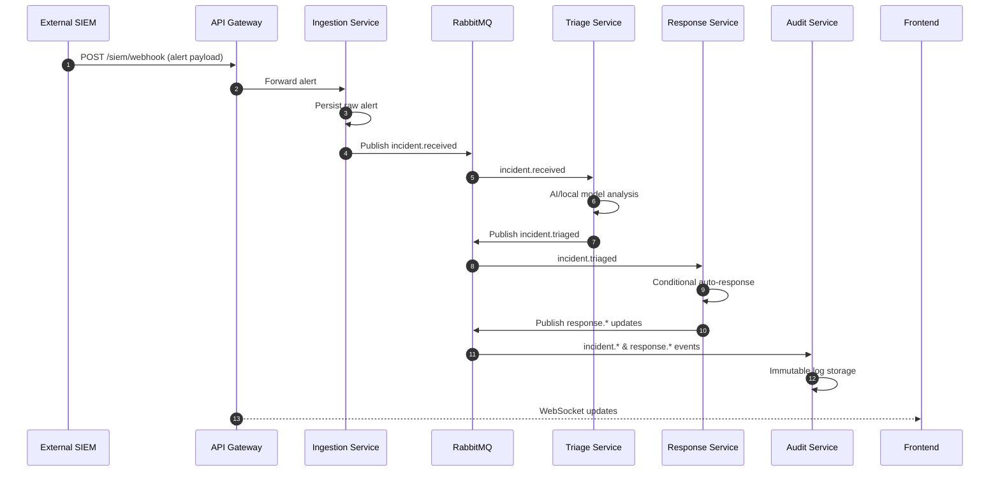

# Event-Driven Workflow

**Key takeaways**

- All cross-service communication happens via the `ransomware_events` topic exchange.
- Integrations (Wazuh, pfSense, threat intel) are switched on/off through `ENABLED_INTEGRATIONS`.
- Auto-response can be disabled globally via `AUTO_RESPONSE_ENABLED=false`.

